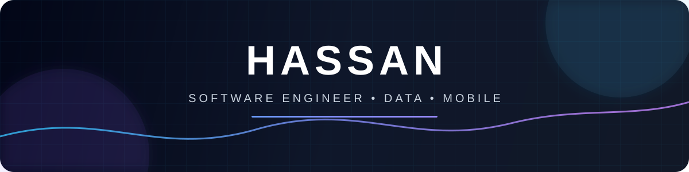
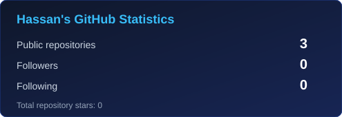
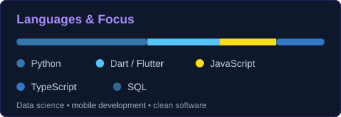

<div align="center">

<a href="https://github.com/user1cars-lab">
  
</a>

<br />

<a href="https://github.com/user1cars-lab?tab=followers"></a>
<a href="https://github.com/user1cars-lab?tab=repositories"></a>
<a href="https://github.com/user1cars-lab"></a>

</div>

## `> whoami`

```python
class Hassan:
    role = "Software Engineer"
    focus = ["Data Science", "Mobile Development", "Clean Software"]
    mindset = "Build simply. Think deeply. Ship reliably."
```

I build reliable software that turns complex problems into simple, useful experiences. I enjoy transforming ideas into polished products through clean architecture, thoughtful design, and continuous learning.

## Tech stack

<div align="center">

<a href="https://skillicons.dev">
  
</a>

<br /><br />


</div>

## Featured projects

<table>
<tr>
<td width="50%">
<h3 align="center">Student Performance Data Science</h3>
<p align="center">Analysis, visualization, and practical machine-learning workflows for understanding student performance.</p>
<p align="center"><a href="https://github.com/user1cars-lab/student-performance-data-science"></a></p>
</td>
<td width="50%">
<h3 align="center">SABR Electronics Flutter</h3>
<p align="center">A modern Flutter application project focused on a practical, accessible mobile experience.</p>
<p align="center"><a href="https://github.com/user1cars-lab/sabr-electronics-flutter"></a></p>
</td>
</tr>
</table>

## GitHub activity

<div align="center">
  
  
</div>

<br />

<div align="center">
</div>

## Connect

<div align="center">

<a href="https://github.com/user1cars-lab"></a>
<a href="mailto:329305212+user1cars-lab@users.noreply.github.com"></a>

<br /><br />

<sub>Thanks for stopping by — let's build something meaningful.</sub>

</div>
